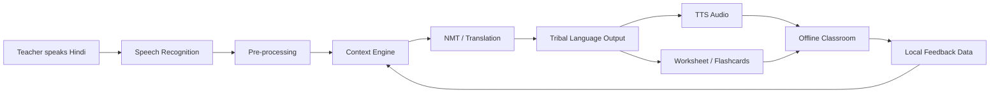

<div align="center">

# 🌉 VaaniSetu

### AI-Powered Vernacular Pedagogy & Real-Time Translation for Mother-Tongue-Based Primary Education

**Smart India Hackathon 2026 · Problem Statement 26042 · Smart Education · Software**

<p>
  
  
  
  
</p>

**Team DARK PHOENIX 2.0 · Team ID 04**

> **VaaniSetu is designed to bridge the gap between Hindi-medium teaching and mother-tongue learning by combining speech recognition, contextual NLP, vernacular translation, audio synthesis and offline classroom tools in one low-resource workflow.**

</div>

---

## 🧭 The Problem

Many tribal-area primary schools face a combination of language and infrastructure constraints:

- Teachers may not be proficient in the learner's mother tongue.
- Learners can struggle when instruction is delivered only in Hindi.
- NLP resources for languages such as **Ho, Mundari and Santhali** are limited.
- Remote classrooms may have unreliable or no internet connectivity.
- Cloud-dependent translation is difficult to rely on in low-connectivity environments.

VaaniSetu addresses this as a **classroom interaction problem**, not just a text-translation problem.

---

## 💡 Our Solution

The application follows a simple classroom loop:

**Teacher speaks Hindi → Speech is recognized → Context is understood → Hindi is translated into a target tribal language → Audio is generated → Learners hear the content in their mother tongue.**

It also extends the translation workflow with:

- bilingual worksheets,
- auto-generated learning content,
- flashcards,
- offline classroom interaction,
- recent translation history,
- locally stored data and model resources.

### 🎯 Target Languages

| Language | Example target |
|---|---|
| **Santhali** | Ol Chiki |
| **Ho** | Warang Chiti |
| **Mundari** | Mundari script / configured target output |

---

## 📱 Product Experience

Instead of relying on screenshots, this README shows the VaaniSetu experience as a simple classroom workflow that can be understood directly on GitHub.

### 👩‍🏫 Teacher Workflow

| Step | Teacher Action | VaaniSetu Response |
|---|---|---|
| **01** | 🗣️ Speak in Hindi | Captures classroom speech |
| **02** | 🎙️ Start translation | Converts speech to text locally |
| **03** | 🧠 Understand context | Uses lesson, FLN vocabulary and local terminology |
| **04** | 🌐 Translate | Produces the selected tribal-language output |
| **05** | 🔊 Play audio | Generates mother-tongue audio for learners |
| **06** | 📚 Create resources | Generates worksheets / flashcards for the lesson |

### 🔄 At a Glance

```text
        👩‍🏫 TEACHER
             │
             ▼
      🗣️ Hindi Speech
             │
             ▼
      🎙️ Speech Recognition
             │
             ▼
       🧠 Context Engine
             │
             ▼
      🌐 Vernacular NMT
             │
        ┌────┴────┐
        ▼         ▼
   🔊 Audio    📄 Content
        │         │
        └────┬────┘
             ▼
      👧🧒 LEARNERS
   Mother-Tongue Learning
```

### 🎯 Product Modules

| Module | Purpose |
|---|---|
| 🎙️ **Live Translation** | Hindi speech → target tribal-language output |
| 🧠 **Context Engine** | Lesson-aware and FLN-aware translation |
| 🔊 **Voice Output** | Audio playback in the configured target language |
| 📚 **Content Generator** | Worksheets, lesson scripts and flashcards |
| 📴 **Offline Mode** | Core AI workflow without continuous internet |
| 💾 **Local Storage** | Translation history and classroom data via SQLite |

## ✨ Core Features

### 🎙️ 1. Speech-to-Speech Translation
Capture the teacher's Hindi speech and route it through speech recognition, translation and tribal-language audio generation.

### 🧠 2. Context-Aware Vernacular Translation
The context layer combines **FLN vocabulary, lesson context and local terminology** before translation.

### 📴 3. Offline-First Classroom Mode
The architecture is designed so core classroom interaction can continue without an internet connection.

### 📚 4. Content Generation
Generate bilingual learning resources such as:
- worksheets,
- lesson scripts,
- activity instructions,
- flashcards,
- classroom-aligned content.

### 🔊 5. Tribal-Language Audio Output
The output path supports synthesized speech for the configured target language using the selected TTS stack.

### 📄 6. Worksheet & Flashcard Export
The decision layer can route generated content to worksheet/PDF and flashcard outputs.

### 🔄 7. Offline Data & Model Improvement
Usage inputs can be stored locally and used as feedback for future model improvement.

---

## 🏗️ Technical Architecture

### End-to-End Pipeline

```text
┌──────────────────┐
│  Teacher Speech  │
└────────┬─────────┘
         ↓
┌──────────────────────────┐
│ Speech Recognition       │
│ Whisper / Vosk pipeline  │
└────────┬─────────────────┘
         ↓
┌──────────────────────────┐
│ Pre-processing           │
│ Noise reduction +        │
│ ASR text normalization   │
└────────┬─────────────────┘
         ↓
┌──────────────────────────┐
│ Context Engine           │
│ FLN + lesson context +   │
│ local terminology        │
└────────┬─────────────────┘
         ↓
┌──────────────────────────┐
│ NMT / Translation Engine │
│ Parallel corpora +       │
│ tribal-language rules    │
└────────┬─────────────────┘
         ↓
┌──────────────────────────┐
│ Decision & Output Layer  │
└───────┬─────────┬────────┘
        ↓         ↓
   TTS Audio   Worksheet / Flashcards
        ↓
┌──────────────────────────┐
│ Offline Classroom        │
│ Voice-to-Voice Learning  │
└──────────────────────────┘
```

---

## 🧩 Technology Stack

| Layer | Technology / Approach |
|---|---|
| Frontend | **Flutter** |
| AI / ML | **Python**, ONNX Runtime |
| NLP / Translation | NMT, bilingual/parallel corpora, context engine |
| Speech Recognition | **Vosk / Whisper** pipeline |
| Text-to-Speech | **Coqui / Vosk-based configured TTS stack** |
| Local Database | **SQLite** |
| Deployment | Android, low-resource devices |
| Model Conversion | PyTorch / Hugging Face → ONNX |
| Runtime Optimization | INT8 / 4-bit quantization |

> The stack above follows the technical approach presented for the SIH solution.

---

## 📴 Why Offline-First?

VaaniSetu is designed around the reality of low-connectivity classrooms.

**Instead of:**

```text
Teacher → Internet → Cloud AI → Internet → Student
```

**The target workflow is:**

```text
Teacher
   ↓
Android Device
   ├── ASR
   ├── Context Engine
   ├── Translation Model
   ├── TTS
   └── SQLite
   ↓
Learner in Mother Tongue
```

This reduces dependence on continuous connectivity and makes the solution suitable for low-resource classroom environments.

---

## ⚡ Optimization for Low-Resource Devices

The presentation identifies several engineering constraints and responses:

- **ONNX Runtime** for local inference.
- **INT8 / 4-bit quantization** to reduce model footprint and inference cost.
- Target deployment on Android devices with around **2 GB RAM**.
- SQLite for local storage.
- Offline model execution instead of requiring cloud inference at runtime.
- Model conversion from PyTorch / Hugging Face pipelines to ONNX.

---

## 🔬 Research & Validation Targets

The SIH presentation identifies the following validation targets:

| Area | Target / Metric |
|---|---|
| Real-time translation | **≤ 3 seconds** target |
| Speech recognition | WER-based evaluation |
| Offline memory footprint | **~1.2 GB** target |
| Device class | Low-resource Android / ~2 GB RAM |
| Languages | Ho, Mundari, Santhali |
| Evaluation | Human evaluation + BLEU / ChrF |
| Usability | SUS-based teacher usability evaluation |

These are **project targets / validation metrics**, not claims of universally achieved performance.

---

## 🌱 Impact

### For Students
- Mother-tongue-supported learning.
- Better access to culturally relevant learning material.
- Increased classroom participation and confidence.

### For Teachers
- Translation assistance for non-tribal-language teachers.
- Reduced dependence on specialist language teachers.
- Faster creation of bilingual classroom resources.

### For Institutions
- Offline-capable digital pedagogy.
- Alignment with foundational learning initiatives described in the SIH presentation.
- A framework that can be extended to additional tribal/minority languages.

---

## 🚀 What Makes VaaniSetu Different?

### 1. Translation is only one layer
VaaniSetu combines **translation + speech + pedagogy + content generation + classroom interaction**.

### 2. Context before translation
The architecture explicitly places **FLN vocabulary, lesson context and local terminology** before the NMT stage.

### 3. Offline by design
The solution is designed around **no-internet classroom operation**, rather than treating offline support as an afterthought.

### 4. Low-resource deployment
Model conversion and quantization are included in the architecture to support constrained Android hardware.

### 5. Feedback loop
Offline classroom data can support iterative model improvement and resource refinement.

---

## 🔄 Classroom Workflow



---

## 📦 Project Structure

```text
VaaniSetu/
├── frontend/              # Flutter application
├── ai/
│   ├── asr/               # Speech recognition
│   ├── nmt/               # Translation models
│   ├── tts/               # Text-to-speech
│   └── context_engine/    # FLN + lesson context
├── models/                # Optimized / ONNX models
├── database/              # SQLite schema and local storage
├── docs/                  # Architecture and research notes
└── README.md
```

> Adjust the folder names above to match the final repository structure before publishing.

---

## 🛠️ Getting Started

> The exact installation commands were not specified in the SIH presentation, so this section is intentionally kept repository-oriented rather than inventing commands.

### Prerequisites

- Flutter SDK
- Android SDK / Android Studio
- Python environment for AI/ML components
- ONNX Runtime-compatible environment
- Required offline ASR / NMT / TTS model files

### Basic Setup

```bash
git clone <YOUR_REPOSITORY_URL>
cd <YOUR_REPOSITORY_FOLDER>

flutter pub get
flutter run
```

If the AI pipeline is maintained separately:

```bash
cd ai
# Install the dependencies listed by the project
# Download / place the required offline models
```

---

## 📊 Solution Snapshot

| Dimension | VaaniSetu |
|---|---|
| Problem Statement | **26042** |
| Theme | **Smart Education** |
| Category | **Software** |
| Team | **DARK PHOENIX 2.0** |
| Team ID | **04** |
| Primary focus | Mother-tongue-based primary education |
| Target languages | **Ho · Mundari · Santhali** |
| Connectivity | **Offline-first** |
| Platform | **Android / low-resource devices** |

---

## 🏆 Smart India Hackathon 2026

**Problem Statement:**  
**AI-Powered Vernacular Pedagogy and Real-Time Translation Tool for Mother Tongue-Based Primary Education**

**Problem Statement ID:** 26042  
**Theme:** Smart Education  
**Category:** Software  
**Team ID:** 04  
**Team:** DARK PHOENIX 2.0

---

## 👥 Team DARK PHOENIX 2.0

| Role | Member |
|---|---|
| Team | **DARK PHOENIX 2.0** |
| Team ID | **04** |
| SIH | **Smart India Hackathon 2026** |

> Add individual member names, GitHub profiles and role ownership here before the final submission.

---

## 📌 Key Performance Targets

| Metric | Target |
|---|---:|
| ⚡ Translation latency | **≤ 3 sec** |
| 💾 Offline model footprint | **~1.2 GB** |
| 📱 Target device memory | **~2 GB RAM Android** |
| 🗣️ Speech evaluation | **WER** |
| 🌐 Translation evaluation | **BLEU / ChrF** |
| 👩‍🏫 Usability evaluation | **SUS + human evaluation** |

> These values are **project validation targets**, not claims of already-achieved production performance.

## 📚 Documentation Roadmap

```text
README.md
│
├── Problem & Solution
├── Product Experience
├── Core Features
├── Technical Architecture
├── Technology Stack
├── Offline-First Design
├── Optimization Strategy
├── Validation Targets
├── Classroom Workflow
├── Project Structure
└── Getting Started
```

---

<div align="center">

### 🌉 VaaniSetu
**Technology that helps classrooms speak the learner's language.**

**Built for Smart India Hackathon 2026 · DARK PHOENIX 2.0**

</div>


